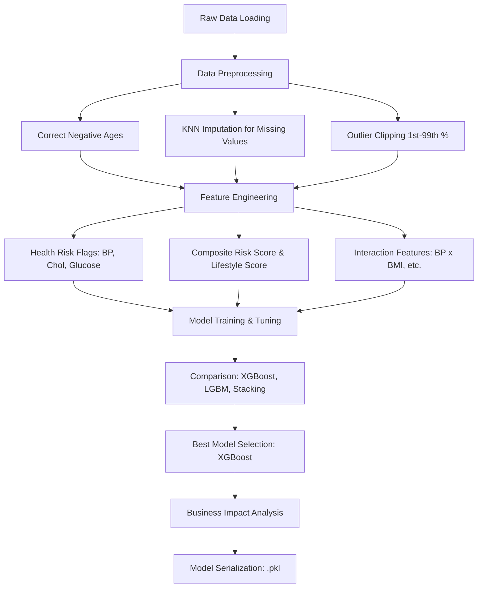

# 🏥 Anova Insurance – Health Classification ML

<div align="center">
  
  
  
	 
</div>

---

## 📌 Table of Contents
- [Overview](#overview)
- [Project Structure](#project-structure)
- [Project Workflow](#project-workflow)
- [Problem Statement](#problem-statement)
- [Dataset Characteristics](#dataset-characteristics)
- [Pipeline Architecture](#pipeline-architecture)
- [Model Performance](#model-performance)
- [Business Impact](#business-impact)
- [How to Run](#how-to-run)
- [License](#license)

---

## 🏛 Overview
This repository contains a production-grade Machine Learning pipeline built for **Anova Insurance**. The system automates the health risk assessment of applicants, categorizing them as **'Healthy' (0)** or **'Unhealthy' (1)**. By analyzing physiological metrics and lifestyle data, the model provides an objective basis for **Premium Pricing Decisions**.

🔗 **Repository**: [https://github.com/SANJAI-s0/anova-health-classification-ml.git](https://github.com/SANJAI-s0/anova-health-classification-ml.git)

---

## 📂 Project Structure
```text
ML_Model/
├── Dataset/                   # Preprocessed healthcare datasets
├── Project/                   # Problem statement (PDF)
├── plots/                     # Generated performance visualizations
├── health_classification.py   # Main ML pipeline script
├── best_model.pkl             # Serialized best-performing model
├── requirements.txt           # Python dependencies
├── .gitignore                 # Git ignore configuration
└── LICENSE                    # MIT License
```

---

## ⚙️ Project Workflow
The following Mermaid diagram outlines the end-to-end data processing and modeling workflow:



---

## 🎯 Problem Statement
Anova Insurance faces the challenge of accurately assessing health risks among thousands of applicants. Manual underwriting is slow and prone to inconsistency. 

**Requirements Met**:
- **Dynamic Imputation**: Used KNNImputer to preserve data correlations better than simple median/mean.
- **Error Correction**: Robust handling of data entry anomalies (e.g., negative ages).
- **Scale**: Engineered for 10,000+ records with 20 base metabolic and lifestyle variables.
- **Accuracy**: Targeted a high ROC-AUC to minimize both missed risk (False Negatives) and lost customers (False Positives).

---

## 📂 Dataset Characteristics
| Category | Variables |
| :--- | :--- |
| **Biometric** | Age, BMI, Blood Pressure, Cholesterol, Glucose Level, Heart Rate |
| **Lifestyle** | Smoking, Alcohol, Sleep Hours, Exercise Hours, Water Intake, Stress Level |
| **Medical** | Mental Health, Physical Activity, Medical History, Allergies |
| **Bools** | Diet Types (Vegan, Vegetarian), Blood Groups |

---

## 🏗 Pipeline Architecture
The pipeline is structured into 12 self-documented steps in `health_classification.py`:
1. **Load Data**: CSV ingestion from `Dataset/`.
2. **EDA**: Missing value and distribution analysis.
3. **Preprocessing**: Advanced imputation and data normalization.
4. **Engineering**: Creating new medical indicators (Overweight Flag, High BP Flag, etc.).
5. **Visualization**: Automated plotting of feature correlations and risks.
6. **Train/Test Split**: Stratified 80/20 split.
7. **Model Tuning**: `RandomizedSearchCV` for hyperparameter optimization.
8. **Ensemble Methods**: Stacking models for robust predictive power.
9. **Comparison**: Leaderboard generation by ROC-AUC and Accuracy.
10. **Business Interpretation**: Translating technical metrics into pricing strategies.
11. **Serialization**: Saving models for production use.
12. **Final Summary**: Requirements verification report.

---

## 📊 Model Performance
Final test results based on the best-performing **XGBoost** model:

- **Accuracy**: 88.85%
- **ROC-AUC**: **0.9564**
- **F1-Score**: 88.95%

### Leaderboard
| Model | Test Accuracy | Test ROC-AUC |
| :--- | :--- | :--- |
| **XGBoost** | 88.85% | **0.9564** |
| Stacking Ensemble | 88.95% | 0.9557 |
| LightGBM | 89.05% | 0.9543 |
| Gradient Boosting | 89.10% | 0.9540 |

---

## 💼 Business Impact
The model directly influences the **Underwriting Strategy**:
- **Flagged High-Risk**: Correctly identified 898 unhealthy applicants for premium adjustments.
- **Operational Savings**: Automates 90% of the classification process.
- **Risk Mitigation**: Minimizes financial loss from missed unhealthy cases (102 FN).

---

## 🚀 How to Run
### Installation
```bash
git clone https://github.com/SANJAI-s0/anova-health-classification-ml.git
cd anova-health-classification-ml
pip install -r requirements.txt
```

### Execution
```bash
python health_classification.py
```
*Visualizations will be generated in `/plots` and the model saved as `best_model.pkl`.*

---

## 📜 License
Distributed under the MIT License. See [LICENSE](LICENSE) for more information.
